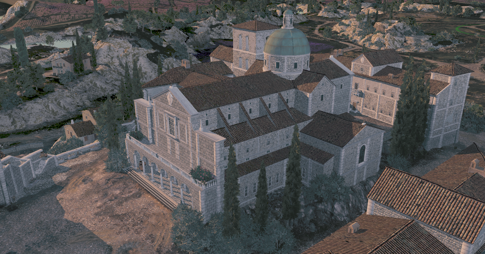

# nuTerra

## World of Tanks map offline viewer writen in VB.NET using Visual Studio 2022 (NET 6.0).

## Third-party credits

Algorithms adapted from other projects and papers:

- **three.js** - the camera damping model follows OrbitControls
  (MIT). <https://github.com/mrdoob/three.js>
- **Moment Shadow Mapping** - Peters & Klein, i3D 2015, for the MSM
  sun-shadow path.
- **Inigo Quilez** - the smoothed terrain normal generation follows
  <https://iquilezles.org/articles/normals/>

Libraries:

- [OpenTK](https://github.com/opentk/opentk) - OpenGL bindings and math
- [Dear ImGui](https://github.com/ocornut/imgui) via
  [ImGui.NET](https://github.com/ImGuiNET/ImGui.NET) - UI
- [AssimpNet](https://bitbucket.org/Starnick/assimpnet) - model import
- [DotNetZip](https://github.com/haf/DotNetZip.Semverd) - package (.pkg) access
- [Pngcs](https://github.com/leonbloy/pngcs) - 16-bit PNG decoding