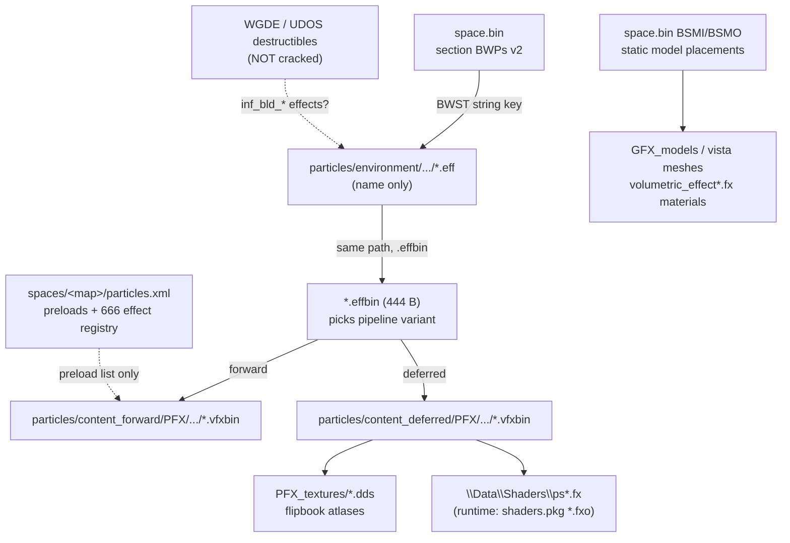
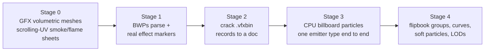

# FX plan — particles, flames, smoke

> **STATUS: this is a historical recon document, kept for the format work in
> it. The plan part is done.** Stage 0 (volumetric meshes), stage 2 (.vfxbin
> cracked), stage 3 (CPU billboard particles) and most of stage 4 (flipbook
> atlas, curves, soft particles) all landed. Current truth lives in
> `FX_PIPELINE.md` (compositing, glow, lighting), `PARTICLES_HANDOFF.md`
> (simulation) and `VFXBIN_PARTICLE_FORMAT.md` (the format).
>
> The open question below about where flipbook atlas frame tables live is
> **answered**: they are in the emitter block itself, not a sidecar — the sheet
> rect is 4 floats at `999+192..+204` ordered `(v_max, u_min, v_min, u_max)`,
> with rows at `+220` and cols at `+224`. The `#Fire` group tags turned out not
> to be needed.

Recon of 2026-08-25 against 101_dday + shared packages. Everything below was
read straight out of the game files; offsets verified in Python before being
written down.

## The data chain (all pieces located)

## Cracked formats

**BWPs (space.bin section, v2)** — ambient effect placements.
Header: `u32 record_size (80)`, `u32 count (288 on Overlord)`. Each record:

| offset | type | meaning |
|---|---|---|
| +0 | float[16] | 4x4 world matrix, row-major, position in row 3 |
| +64 | u32 | **BWST string key** of the effect, e.g. `particles/environment/interior/101_dday_smoke_plume.eff` |
| +68 | u32 | flags (seen `0x3C0`, `0`) |
| +72 | u32 | seen `0xFFF00003` / `0xFFFFFFFF` |
| +76 | float | `0.1` on every record — scale or LOD bias |

All 23 distinct keys on Overlord resolve through `cBWST.find_str` — no new
hash needed, it is the same string table everything else uses.

**.effbin (444 B)** — WG typed-record wrapper (`u32 type-id`, `u32 size`
framing, ids 0x3EE/0x3EF): two fixed-size string slots, the forward and the
deferred `.vfxbin` path. That is its entire content.

**.vfxbin** — the actual effect definition. Same typed-record serialization
(ids 0x3EB/0x3EC seen). Observed inside `101_dday_fire_dot`:
LOD blocks with ranges in the name (`Lod_0_3100`, `Lod_0_120`), named
emitters (`fire_looped_real`, `smoke_dark1..4`, `smoke_extralonglife`),
texture path, shader path (`\Data\Shaders\ps.fx`), flipbook atlas group tags
(`#Fire#Fire_darkfake#Fire_allfake`, `#Smoke_dark`, `#Explosion...`), and
float runs that are curve keyframes. **Record schema NOT cracked yet.**

**particles.xml (per space, packed XML)** — `<forward>`/`<deferred>`, each:
`<preload>` shader+texture warm-up pairs and 666 `<fn_effect_bin>` paths.
It is a registry/preload list, NOT placement - placements are BWPs (ambient)
plus, presumably, destructibles for the `inf_bld_*` per-building effects.

**GFX_models** (the mesh side, already placed via BSMI like any static
model; `MapGfxMarkers` finds them): visuals carry `volumetric_effect_vtx.fx`
family materials with everything needed to render:
`diffuseMap`, vertex-colour stream, `diffuseUVSpeedAlphaOffset` (scrolling
UV), `distortion_UV_Speed_Amount`, `lightMultipliers`, `selfIllumLight`,
`doubleSided`, `enableLighting`. Today these fx names all map to
`ShaderTypes.FX_unsupported` in `modSpaceBin.vb`.

**Game shaders** — `res/packages/shaders.pkg`: 826 compiled `.fxo`
(dx10/dx11 DXBC) + 89 xml manifests. Includes the whole
`custom/volumetric_effect*` and `custom/emissive*` families. Same blob
format the terrain mixer was transcribed from, so disassembly-and-transcribe
is a proven path.

## Build order

- **Stage 0 - biggest visible win, no new formats.** Give the
  `volumetric_effect*` fx family a real shader instead of `FX_unsupported`:
  translucent forward pass after deferred, scrolling UV from
  `diffuseUVSpeedAlphaOffset`, vertex colour as alpha shaper, self-illum.
  Vista smoke columns and flame sheets start moving. Transcribe
  `custom/volumetric_effect_vtx.fxo` first.
- **Stage 1 - cheap.** Parse BWPs (layout above), resolve names via BWST,
  upgrade MapGfxMarkers to show every ambient effect point with its name.
  This is the ground truth display for everything after.
- **Stage 2 - the research step.** Walk the .vfxbin typed records (the
  reader for effbin/vfxbin framing is ~30 lines), name the fields against
  what the effect visibly is, write the doc. The scratchpad has a working
  packed-XML decoder (`bwxml.py`) as a starting pattern.
- **Stage 3 - first real particles.** One emitter type (point-spawn,
  velocity + gravity, lifetime, size/alpha over life), CPU sim, camera-facing
  quads, one draw per effect, additive vs alpha from the shader tag.
  Fire dots and smoke plumes are this.
- **Stage 4 - fidelity.** Flipbook atlas groups (`#Fire` tags), curve
  playback, soft-particle depth fade (deferred variant), LOD ranges from the
  `Lod_0_*` blocks.

## Open questions

- Where the flipbook atlas frame tables live (the `#Fire` group names must
  map to UV rects somewhere - likely the 89 xml in shaders.pkg or a
  PFX_textures sidecar).
- How `inf_bld_*` effects attach to buildings (WGDE/UDOS sections, both
  unparsed).
- What BWPs flags/`0xFFF00003` mean - probably enable masks; harmless to
  ignore for a viewer.
